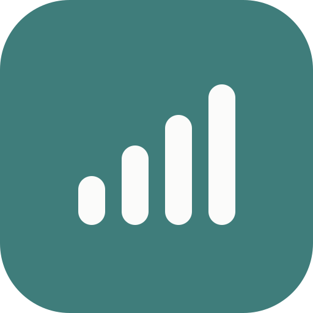
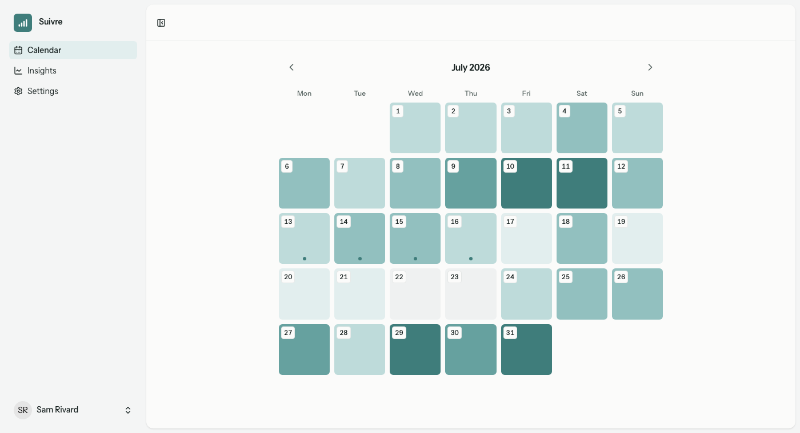
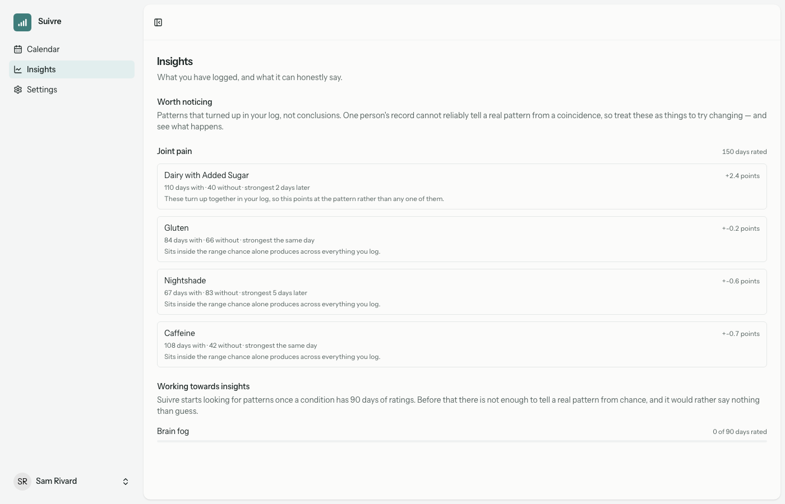
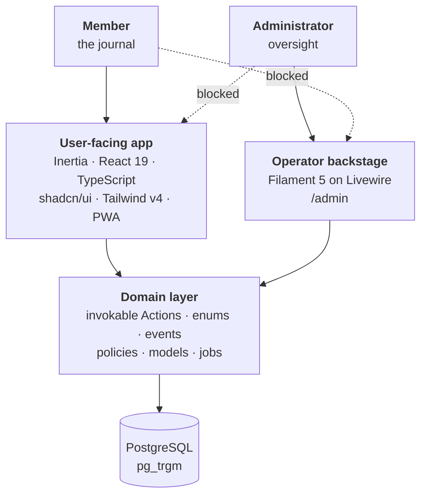
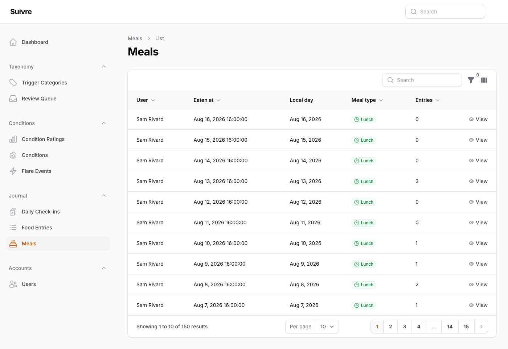

<div align="center">



<h1>Suivre</h1>

<p><strong>A food and symptom journal that measures triggers on a delay.</strong></p>

<p>Meals go in as text; each tracked condition gets a daily 0–10 rating. After ninety<br />
days it ranks which foods line up with the bad days, and at what lag.</p>

<p>
<a href="https://github.com/mgballou/suivre/actions/workflows/tests.yml"></a>
<a href="https://github.com/mgballou/suivre/actions/workflows/lint.yml"></a>


</p>

</div>

<br />

<picture>
  <source media="(prefers-color-scheme: dark)" srcset="docs/assets/calendar-dark.png" />
  
</picture>

Each day is shaded by the worst condition rating recorded on it. A dot marks a day with a
check-in. Tapping a day opens it for logging.

---

## What it records

|  | | |
| :-: | --- | --- |
|  | **The day** | Sleep, mood, stress and a note. Two taps to file a day. |
|  | **Conditions** | Defined by the account holder and rated 0–10 daily, plus acute flares carrying a time, an intensity and a duration. |
|  | **Meals** | One food per line. A deterministic classifier tags each line against a curated taxonomy, using trigram matching in Postgres. |
|  | **Insights** | Counts, trends and a heatmap from day one; a ranking after ninety. |
|  | **Backstage** | A Filament panel for the taxonomy, the food catalog, the classification review queue and accounts. |

---

## How the ranking works

<picture>
  <source media="(prefers-color-scheme: dark)" srcset="docs/assets/insights-dark.png" />
  
</picture>

Correlating one person's diet against one person's symptoms is a small sample with a long
lag and heavy confounding. A [spike](docs/2026-07-18-lag-lift-spike-findings.md) planted
known triggers in synthetic journals and measured what a ranking could recover from them.
The thresholds it produced are what the engine runs on:

- **Ranking starts at ninety days of ratings.** Below that the page shows counts, a trend
  and a heatmap instead.
- **Lift is measured across lags from same-day out to a week**, and each suspect names its
  strongest.
- **Each tag is checked against its own noise band.** Its occurrences are shifted along the
  timeline up to sixty times to see what lift falls out by chance. Tags that land under
  their band are still listed, marked as such.
- **Tags that keep appearing together are reported as a pair.** Dairy and sugar eaten on the
  same days are ranked as one row, because the log has no day that separates them.

---

## Start with the decision log

**[`docs/decisions/decision-log.md`](docs/decisions/decision-log.md)** is 27 numbered
entries covering every significant product and architecture decision here. Each states the
decision, the reasoning, and what it rules out. It is append-only and newest-last, so a
later entry supersedes an earlier one rather than editing it.

Reversals stay visible: D7 chose Livewire for the user-facing app and D19 replaced it with
Inertia and React. Both are still there with the argument that moved between them.

`CLAUDE.md` is the other half of the convention. It is generated from the guideline sources
in `.ai/` and is the day-to-day build spec — the rules the code is held to. When a decision
invalidates a line in there, correcting it belongs to the same change, since the guidelines
are what gets read while the decision log only explains why.

---

## Architecture

Two front ends, one shared domain layer.



Each role reaches one half of the application, and both directions are enforced. A member
gets a 403 at `/admin`; an administrator is redirected out of the journal and out of
`/settings`, and manages its own credentials on the backstage's profile page. Accounts are
created from the backstage rather than by public registration, which is why account
creation takes an explicit timezone — there is no browser present to report one.

### The domain layer

Business logic lives in single-purpose invokable **Actions** under
`app/Services/{Domain}/Actions/` — `LogMeal`, `ClassifyFoodEntry`, `ComputeCorrelations`.
One public `__invoke`, named arguments at the call site, resolved through the container at
the point of use rather than constructor-injected, so it stays obvious that control has been
handed to a separate class. Filament actions, jobs, listeners, policies and controllers
compose them and hold no logic of their own.

Around that:

- **Enums are domain primitives.** Each carries its predicates and the matching set helper —
  `isActive()` alongside `getActiveStatuses()` — so a call site reads the filter off the enum
  rather than reproducing it. They implement Filament's `HasLabel`, `HasColor` and `HasIcon`,
  so badges and selects render from the same source.
- **Domain events decouple side effects.** An observer turns a raw model lifecycle hook into
  a meaningful event; queued listeners react. Events fired inside a transaction implement
  `ShouldDispatchAfterCommit`.
- **Policies return `Response`, never `bool`**, so the reason for a denial reaches the UI and
  the policy stays the one place a precondition is expressed.
- **Strict Eloquent** is on globally — lazy loading, missing attributes and silent mass
  assignment all throw locally and report in production.
- **PHPStan level 9, with no baseline.**

The full rules, including the anti-patterns each exists to prevent, are in
[`.ai/guidelines/architecture.blade.php`](.ai/guidelines/architecture.blade.php).

### Typed routes via Wayfinder

**Laravel Wayfinder** reads the route and controller definitions and generates TypeScript
functions into `resources/js/routes` and `resources/js/actions`, imported as `@/routes/*` and
`@/actions/*`. Renaming a route or changing a parameter surfaces as a type error at `tsc`
rather than a 404 in the browser.

That output is gitignored. It is produced by the Vite plugin during a build and by
`herd php artisan wayfinder:generate --with-form`, which the quality gate runs before `tsc`
so there is something to typecheck against.

### Dates come from the server

The journal is keyed to the account holder's local day, and `new Date()` reads the device
timezone instead of the account's configured one — so the browser is the wrong place to work
out what day it is. Every date, month and label arrives from the server already formatted,
and the user-facing app does no date arithmetic at all.

Colour works the same way. A condition's hue comes from a curated set, and the 0–10 rating
is bucketed to a ramp step server-side, so the client never keeps a second copy of the scale.
A test fails if any step misses WCAG AA.

### PWA delivery

The user app is installable and online-first. `resources/views/app.blade.php` links a
`/manifest.webmanifest`; `public/sw.js` and `resources/js/lib/service-worker.ts` handle
registration and update. iOS ignores the manifest for add-to-home-screen, so the
Apple-specific meta tags are set alongside it. Offline capture is out of scope for now.

---

## The backstage



Filament 5 at `/admin`, still on Livewire. It carries the trigger taxonomy, the food catalog,
the classification review queue and account oversight — operator work, kept out of the
member-facing app.

---

## Stack

- PHP 8.4, Laravel 13, Octane (FrankenPHP)
- PostgreSQL — chosen for `pg_trgm`, which backs fuzzy matching in the food classifier
- Inertia 3, React 19, TypeScript, Tailwind v4, Vite, Wayfinder
- Filament 5 for the backstage; Livewire 4 stays installed for it
- Laravel Fortify for authentication; spatie/laravel-permission for roles
- Pest 4, Larastan/PHPStan level 9, Pint

## Quality gates

```bash
herd composer check
```

Runs Pint, PHPStan level 9, `wayfinder:generate --with-form`, `tsc --noEmit` plus vitest, and
Pest, in that order. Tests run against a dedicated PostgreSQL database (`suivre_test`), so
the suite exercises Postgres-only behavior directly.

CI mirrors that gate across parallel jobs — `static-analysis` (PHPStan), `frontend` (`tsc` +
vitest) and `test` (Pest on `postgres:18`) in `tests.yml`, plus `quality` (Pint `--test`) in
`lint.yml`. A green CI run means the same thing as a green local gate. The pre-push hook can
be bypassed with `--no-verify`; CI cannot, so it is the real gate. Deploys run from GitHub
Actions after the test workflow has succeeded on `main`.

## Local setup

Everything runs through Laravel Herd — `herd php` and `herd composer`, not bare `php` or
`composer`. Postgres is a Herd service.

```bash
herd composer install
cp .env.example .env          # if .env does not exist
herd php artisan key:generate
npm install && npm run build
herd php artisan migrate
```

Served at `https://suivre.test`. A Vite manifest error means the front end has not been
built — run `npm run build` or `npm run dev`.

The full walkthrough — Postgres setup, the `suivre_test` database, git hooks, worktrees — is
in [`docs/local-setup.md`](docs/local-setup.md).

---

## Repository map

| Path | What is in it |
| --- | --- |
| [`docs/decisions/decision-log.md`](docs/decisions/decision-log.md) | The 27 recorded decisions. Start here. |
| [`docs/roadmap.md`](docs/roadmap.md) | The MVP epics, and the v1 phase that follows them. |
| [`docs/2026-07-18-lag-lift-spike-findings.md`](docs/2026-07-18-lag-lift-spike-findings.md) | What the correlation spike found, and the thresholds it set. |
| [`docs/superpowers/specs/`](docs/superpowers/specs/) · [`plans/`](docs/superpowers/plans/) | Dated design artifacts. Each carries a status banner saying whether it still applies. |
| [`docs/local-setup.md`](docs/local-setup.md) · [`docs/deployment.md`](docs/deployment.md) | Running it locally; the Railway staging runbook. |
| `CLAUDE.md` · [`.ai/guidelines/`](.ai/guidelines/) | The build spec the code is held to; `CLAUDE.md` is generated from `.ai/`. |
| `app/Services/{Domain}/Actions/` | Business logic, one Action per file. |
| `app/Filament/` | The operator backstage. Schemas extracted per resource. |
| `resources/js/pages/` · `components/suivre/` | Inertia pages and product components. |
| `tests/` | Pest, mirroring the source paths. |

---

## License

MIT — see [`LICENSE`](LICENSE).

<div align="center">
<br />
<sub>A working application, public as a sample of how I build.</sub>
</div>
