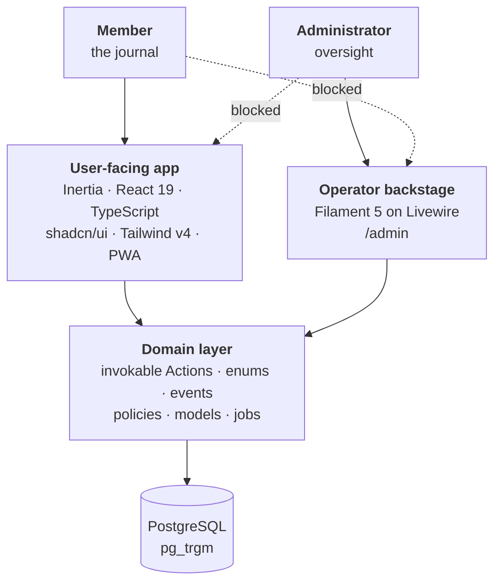

<div align="center">


<h1>Suivre</h1>

<p><strong>A food and symptom journal that looks for what happened <em>days</em> before a flare,<br />
not minutes before it.</strong></p>

<p>Two taps a day. Ninety days in it starts ranking suspects — and says plainly<br />
when two of them travel together and it cannot tell them apart.</p>

<p>
<a href="https://github.com/mgballou/suivre/actions/workflows/tests.yml"></a>
<a href="https://github.com/mgballou/suivre/actions/workflows/lint.yml"></a>


</p>

</div>

<br />

<picture>
  <source media="(prefers-color-scheme: dark)" srcset="docs/assets/calendar-dark.png" />
  
</picture>

A month at a glance. Every day carries the worst rating recorded on it, on one petrol
ramp — depth, not damage. There is no red, no streak, no score, and nothing that
congratulates you for logging.

---

## What it records

|  | | |
| :-: | --- | --- |
|  | **The day** | Sleep, mood, stress, a note. Two taps, and the day is on file. |
|  | **Conditions** | Your own list, each on a 0–10 daily rating, plus acute flares with a time and a duration. |
|  | **Meals** | One food per line. A deterministic classifier tags each against a curated trigger taxonomy — no model, no API call. |
|  | **Insights** | What you logged, and once there is enough of it, what it can honestly say. |
|  | **Backstage** | A Filament panel for taxonomy, the classification review queue and account oversight. Not the end-user app. |

It is not calorie counting and it is not fitness tracking.

---

## What it will, and will not, say

<picture>
  <source media="(prefers-color-scheme: dark)" srcset="docs/assets/insights-dark.png" />
  
</picture>

Correlating one person's diet against one person's symptoms is a small-sample problem
with a long lag and heavy confounding, and most of the design is about not overclaiming
on it. A [spike](docs/2026-07-18-lag-lift-spike-findings.md) planted known triggers in
synthetic journals and measured what a ranking could actually recover:

- **Nothing is ranked under ninety days of ratings.** Below that the surface is
  descriptive — your own record read back to you — because a ranking on sixty days
  recovers noise as readily as signal.
- **Every suspect is measured against its own noise band.** A tag's occurrences are
  shifted along the timeline up to sixty times to see what lift chance alone produces;
  a tag that fails to clear its own band is shown saying so rather than quietly omitted.
- **Tags that always co-occur are never separated.** Dairy and sugar arriving together
  are reported as the pair, because the data cannot tell you which one it was and
  pretending otherwise is the failure worth avoiding.
- **The lag is the point.** Lift is measured across a profile out to a week, not at a
  single offset, so a trigger that lands two days later is not missed.

---

## Start with the decision log

**[`docs/decisions/decision-log.md`](docs/decisions/decision-log.md)** is 27 numbered
entries recording every significant product and architecture decision here. Each states
the decision, the reasoning, and — the part that does the work — what it **rules out**.
It is append-only and newest-last, so a later entry supersedes an earlier one rather
than editing it.

Reversals stay visible: D7 chose Livewire for the user-facing app and D19 replaced it
with Inertia and React, and both are still there with the argument that moved between
them. If you only read one file, read that one.

`CLAUDE.md` is the other half of the convention. It is generated from the guideline
sources in `.ai/` and is the day-to-day build spec — the rules the code is actually held
to. When a decision invalidates a line in there, correcting it is part of the same
change, because the guidelines are what gets read and acted on while the decision log
only explains why.

---

## Architecture

Two front ends, one shared domain layer.



The two roles reach opposite halves of the application and **both** directions are
enforced. A member cannot open `/admin`; an administrator is redirected out of the
journal and out of `/settings`, and manages its own credentials on the backstage's own
profile page instead. There is no public registration — an account begins in the
backstage, and it is created with an explicit timezone, because no browser is present to
report one.

### The domain layer

Business logic lives in single-purpose invokable **Actions** under
`app/Services/{Domain}/Actions/` — `LogMeal`, `ClassifyFoodEntry`, `ComputeCorrelations`.
One public `__invoke`, named arguments at the call site, resolved through the container
at the point of use rather than constructor-injected, so it stays obvious that control is
handed to a separate class. Everything else is a shell that composes them: Filament
actions, jobs, listeners, policies and controllers hold no logic of their own.

Around that:

- **Enums are domain primitives**, not string constants. Each carries its predicates and
  the matching set helper — `isActive()` alongside `getActiveStatuses()` — so a call site
  reads the filter off the enum instead of reproducing it. They implement Filament's
  `HasLabel`, `HasColor` and `HasIcon`, so badges and selects render from the same
  source.
- **Domain events decouple side effects.** An observer turns a raw model lifecycle hook
  into a meaningful event; queued listeners react. Events fired inside a transaction
  implement `ShouldDispatchAfterCommit`.
- **Policies return `Response`, never `bool`**, so the reason for a denial reaches the
  UI, and the policy stays the single place a precondition is expressed.
- **Strict Eloquent** is on globally — no lazy loading, no missing attributes, no silent
  mass assignment. It throws locally and reports in production.
- **PHPStan level 9 with no baseline.** Nothing is suppressed.

The full set of rules, including the anti-patterns each exists to prevent, is in
[`.ai/guidelines/architecture.blade.php`](.ai/guidelines/architecture.blade.php).

### Typed routes via Wayfinder

The React side never hard-codes a URL. **Laravel Wayfinder** reads the route and
controller definitions and generates TypeScript functions into `resources/js/routes` and
`resources/js/actions`, imported as `@/routes/*` and `@/actions/*`. Renaming a route or
changing a parameter surfaces as a type error at `tsc` rather than a 404 in the browser.

That output is gitignored. It is produced by the Vite plugin during a build and by
`herd php artisan wayfinder:generate --with-form`, which the quality gate runs before
`tsc` — otherwise there would be nothing to typecheck against.

### Dates, and why the client never derives one

`new Date()` reads the device timezone rather than the account's configured one, so a
journal keyed on the user's local day cannot let the browser decide what day it is. Every
date, month and label arrives from the server already formatted, and there is no
client-side date arithmetic in the user-facing app at all.

Colour follows the same rule: a condition's hue comes from a curated set, and the 0–10
rating is bucketed to a ramp step server-side, so the client never computes a second,
drifting copy of the scale. A test fails if any step misses WCAG AA.

### PWA delivery

The user app is installable and online-first. `resources/views/app.blade.php` links a
`/manifest.webmanifest`; `public/sw.js` and `resources/js/lib/service-worker.ts` handle
registration and update. iOS ignores the manifest for add-to-home-screen, so the
Apple-specific meta tags are set explicitly alongside it. Offline capture is out of scope
for now.

---

## The backstage


Filament 5 at `/admin`, still on Livewire, deliberately not the end-user interface. It
carries the trigger taxonomy, the food catalog, the classification review queue and
account oversight — the things an operator does, none of the things a member does.

---

## Stack

- PHP 8.4, Laravel 13, Octane (FrankenPHP)
- PostgreSQL — chosen for `pg_trgm`, which backs fuzzy matching in the food classifier
- Inertia 3, React 19, TypeScript, Tailwind v4, Vite, Wayfinder
- Filament 5 for the backstage; Livewire 4 stays installed for it
- Laravel Fortify for authentication; spatie/laravel-permission for roles
- Pest 4, Larastan/PHPStan level 9, Pint

## Quality gates

```bash
herd composer check
```

Runs Pint, PHPStan level 9, `wayfinder:generate --with-form`, `tsc --noEmit` plus vitest,
and Pest, in that order. Tests run against a dedicated PostgreSQL database
(`suivre_test`) rather than sqlite, so Postgres-only behavior is exercised by the suite
instead of abstracted around.

CI mirrors that gate across parallel jobs — `static-analysis` (PHPStan), `frontend`
(`tsc` + vitest) and `test` (Pest on `postgres:18`) in `tests.yml`, plus `quality` (Pint
`--test`) in `lint.yml`. A green CI run means the same thing as a green local gate. The
pre-push hook can be bypassed with `--no-verify`; CI cannot, so it is the real gate.
Deploys run from GitHub Actions and only after the test workflow has succeeded on `main`,
so a red `main` never ships.

## Local setup

Everything runs through Laravel Herd — `herd php` and `herd composer`, not bare `php` or
`composer`. Postgres is a Herd service.

```bash
herd composer install
cp .env.example .env          # if .env does not exist
herd php artisan key:generate
npm install && npm run build
herd php artisan migrate
```

Served at `https://suivre.test`. A Vite manifest error means the front end has not been
built — run `npm run build` or `npm run dev`.

The full walkthrough — Postgres setup, the `suivre_test` database, git hooks, worktrees —
is in [`docs/local-setup.md`](docs/local-setup.md).

---

## Repository map

| Path | What is in it |
| --- | --- |
| [`docs/decisions/decision-log.md`](docs/decisions/decision-log.md) | The 27 recorded decisions. Start here. |
| [`docs/roadmap.md`](docs/roadmap.md) | The MVP epics, and the v1 phase that follows them. |
| [`docs/2026-07-18-lag-lift-spike-findings.md`](docs/2026-07-18-lag-lift-spike-findings.md) | What the correlation spike found, and the thresholds it set. |
| [`docs/superpowers/specs/`](docs/superpowers/specs/) · [`plans/`](docs/superpowers/plans/) | Dated design artifacts. Each carries a status banner saying whether it still applies. |
| [`docs/local-setup.md`](docs/local-setup.md) · [`docs/deployment.md`](docs/deployment.md) | Running it locally; the Railway staging runbook. |
| `CLAUDE.md` · [`.ai/guidelines/`](.ai/guidelines/) | The build spec the code is held to; `CLAUDE.md` is generated from `.ai/`. |
| `app/Services/{Domain}/Actions/` | Business logic, one Action per file. |
| `app/Filament/` | The operator backstage. Schemas extracted per resource. |
| `resources/js/pages/` · `components/suivre/` | Inertia pages and product components. |
| `tests/` | Pest, mirroring the source paths. |

---

## License

MIT — see [`LICENSE`](LICENSE).

<div align="center">
<br />
<sub>The repository is a working application, not a demo. It is public as a sample of how I build.</sub>
</div>
