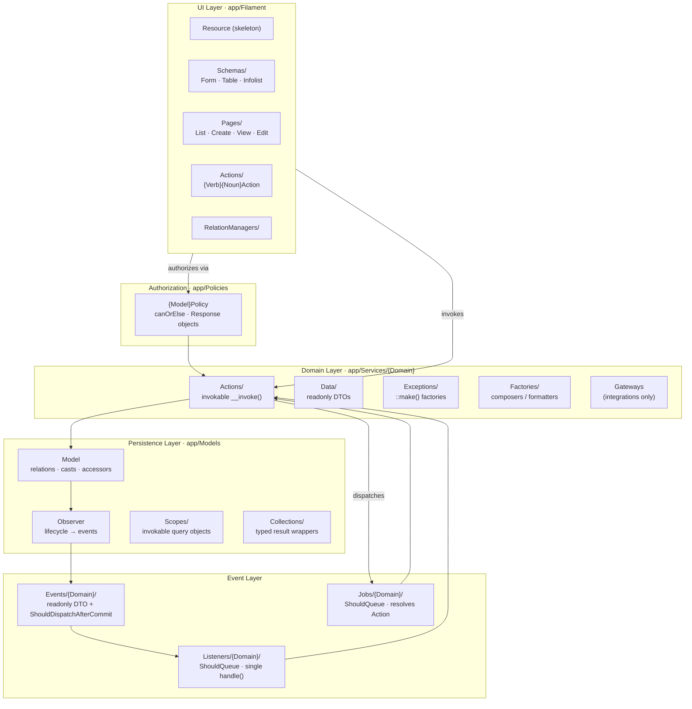
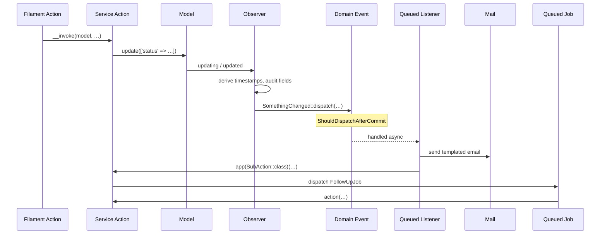

# Architectural Sensibility

A portable specification of how the team builds Laravel + Filament applications. Domain-agnostic by design — drop this into any project and code that follows it should feel like it was written by the same hands.

> **How to read this:** every section is normative. "Prefer", "always", "never" are deliberate. Where two rules collide, the more specific one wins. Examples use a hypothetical `Post` model — substitute your own domain.

---

## 1. Guiding Principles

1. **Single-purpose, invokable Actions** carry all business logic. Controllers, Jobs, Listeners, Filament Actions, Console commands, and Policies are *thin shells* that compose Actions.
2. **The model is the domain object, not just the persistence object.** Models own relationships, casts, accessors, and derived state. They do **not** own multi-step business flows.
3. **Enums are first-class domain citizens.** They carry state-machine predicates, display metadata, and enumerated set helpers — not just constant values.
4. **Domain events propagate side-effects.** Observers translate model lifecycle into domain events; queued listeners fan out to mail, jobs, downstream actions.
5. **Type safety is non-negotiable.** PHPStan level 9, `declare(strict_types=1)`, `Model::shouldBeStrict()`, generic-typed relationships, typed config access.
6. **Filament is the entire authenticated UI.** No bespoke controllers or blades for admin/user flows. UI logic lives in resource sub-trees with strict naming.
7. **Authorization lives in Policies, not in the UI.** Filament discovers policies automatically; tests assert against them; the UI never re-implements policy logic.
8. **Strict-mode Eloquent.** No lazy loading, no missing attributes, no silent mass-assignment violations.

---

## 2. The Layered Topology



**Reading the diagram:** information flows down (UI → Action → Model). Side-effects flow back up through events. The Action is the *only* place that orchestrates more than one thing at a time.

---

## 3. Directory Layout

```
app/
├── Casts/                    # Custom Eloquent casts
├── Console/Commands/Script/  # One-shot data-migration commands (script:*)
├── Enums/                    # State + display metadata. Sub-folders Concerns/, Collections/
├── Events/{Domain}/          # Immutable event DTOs, ShouldDispatchAfterCommit
├── Exceptions/               # Top-level domain exceptions
├── Filament/
│   ├── Admin/                # Admin panel
│   │   └── Resources/{Plural}/
│   │       ├── {Model}Resource.php          # Skeleton: model, slug, icon, pages, relations
│   │       ├── Schemas/                     # {Model}Form · {Plural}Table · {Model}Infolist
│   │       ├── Actions/                     # {Verb}{Noun}Action extends Action
│   │       ├── Pages/                       # List · Create · View · Edit
│   │       ├── RelationManagers/
│   │       └── Widgets/
│   ├── {OtherPanel}/         # Same structure for any second panel (customer-facing, etc.)
│   └── Concerns/             # Cross-panel traits
├── Http/                     # Webhooks + minimal controllers only
├── Jobs/{Domain}/            # Thin queue wrappers around Actions
├── Listeners/{Domain}/       # ShouldQueue, single handle(), delegates to Action
├── Mail/                     # Mailables; bodies via templates when possible
├── Models/
│   ├── Concerns/             # Reusable model traits (DefinesPermissions, CanOrElse, …)
│   ├── Scopes/               # Invokable scope classes
│   └── Collections/          # Typed Eloquent collections
├── Notifications/
├── Observers/                # Lifecycle hooks → dispatch domain events
├── Policies/                 # {Model}Policy, returns Response objects
├── Providers/                # AppServiceProvider, RelationServiceProvider, ModelServiceProvider…
├── Services/{Domain}/
│   ├── Actions/              # Invokable single-purpose classes
│   ├── Data/                 # readonly DTOs (Spatie Data when crossing boundaries)
│   ├── Exceptions/           # {Reason}Exception with ::make() factories
│   ├── Factories/            # Pure composers (text, price, etc.)
│   ├── Contracts/            # Capability interfaces
│   └── Repositories/         # Read models for settings/templates/etc.
└── Settings/                 # Spatie Settings, group + DefinesPermissions trait
```

A feature is split horizontally by *layer* (UI / Domain / Persistence / Eventing) and vertically by *domain*. Every domain has the same internal shape.

---

## 4. The Action Pattern

Actions are the spine of the codebase. **All business logic** lives in actions.

### 4.1 Shape

```php
<?php

declare(strict_types=1);

namespace App\Services\Posts\Actions;

use App\Enums\PostStatus;
use App\Jobs\Posts\NotifySubscribersJob;
use App\Models\Post;

class PublishPost
{
    public function __invoke(Post $post, string $reason): void
    {
        $post->update([
            'status' => PostStatus::Published,
            'published_reason' => $reason,
        ]);

        dispatch(new NotifySubscribersJob(
            post: $post,
            reason: $reason,
        ));

        if ($post->draft?->active()) {
            dispatch(new ArchiveDraftJob($post->draft));
        }
    }
}
```

### 4.2 Rules

- **One public method: `__invoke`.** Helpers may be private.
- **Named parameters at every non-trivial call site** (`$publishPost(post: $p, reason: $r)`).
- **Imperative, descriptive class names**: `PublishPost`, `CreateCommentForPost`, `CheckUserHasOverdueItems`, `RemoveTagFromPost`. Verb first, then noun phrase.
- **Resolve via the container, not `new`.** From other actions: `app(CheckSomething::class)($x)`. From Filament: type-hint as a callback parameter (`fn (..., PublishPost $publishPost) => …`). From Jobs / Listeners: type-hint on `handle()`.
- **Return `void`, a model, a primitive, or a `readonly` DTO.** Never an array.
- **Throw typed domain exceptions for failure** (`throw_if(condition: …, exception: SomeException::make($x))`).

### 4.3 Composition

Actions call other actions freely. Side-effects — mail, jobs, sub-actions — are chained inside the parent action's `__invoke`. There is no Pipeline or Workflow abstraction; sequence is read top-to-bottom.

### 4.4 When *not* to make an action

- A trivial query that belongs on the model (`->where()->first()`).
- A pure transformation that belongs on a Factory or accessor.
- A getter-style read that belongs on a Repository.

If you can't name it as `{Verb}{Noun}` without contortion, it isn't an action.

---

## 5. Models

Models describe state and provide read-side derivations. They never orchestrate multi-step flows.

### 5.1 Class shell

```php
#[ObservedBy(PostObserver::class)]
class Post extends Model implements
    AuditableContract,
    HasComments,
    HasFilamentAdminPanelUrl
{
    use Auditable;
    use DefinesPermissions;
    /** @use HasFactory<PostFactory> */
    use HasFactory;

    protected $attributes = ['status' => PostStatus::Draft];

    protected $fillable = [/* explicit list */];

    protected $casts = [
        'status' => PostStatus::class,
        'price' => MoneyCast::class,
        'published_at' => 'datetime',
    ];
}
```

### 5.2 Conventions

- **Observers attached via the `#[ObservedBy]` attribute**, not the service provider.
- **Capability interfaces over base classes.** Small, single-axis interfaces (`HasComments`, `HasFilamentAdminPanelUrl`) that often `@phpstan-require-extends Model`. Compose them by intersection (`HasComments&Model`).
- **Reusable behavior as traits in `Models/Concerns/`.** `DefinesPermissions`, `CanOrElse`, `Auditable`, `HasSlaCheck`, `Disables`.
- **Generic-typed relationships.** `/** @return BelongsTo<User, $this> */` on every relation method.
- **Casts to enums and value casts everywhere.** No raw integers/strings for status, no float columns for currency. A `MoneyCast` stores integers and presents floats; an `UppercaseCast` normalises codes.
- **Accessors via `Attribute::get(…)`.** Keep them one-liners — compose business strings/values via Factories or Actions.
- **Custom collection classes** when a relation needs typed methods: `PostCollection extends Collection`.
- **Scopes are invokable classes** in `Models/Scopes/`, applied with `->tap(new ActiveAndVisible())`. Local methods on the model are reserved for pre-filtered relations (`activeComments()`).
- **Strict mode is enabled globally** in `ModelServiceProvider`: `Model::shouldBeStrict()`. Lazy loading and missing-attribute violations throw in `local`/`testing`, report in `production`.
- **`getMorphClass()` is the single source of truth** for polymorphic strings. The morph map lives in `RelationServiceProvider::boot()` and matches table names.

### 5.3 ModelServiceProvider

Every project has one. Boot strict mode and configure how violations behave:

```php
class ModelServiceProvider extends ServiceProvider
{
    public function boot(): void
    {
        Model::shouldBeStrict();

        Model::handleLazyLoadingViolationUsing(function ($model, $key) {
            if (! $this->reportModel($model)) return;
            if (! $model->exists || $model->wasRecentlyCreated) return;
            $e = new LazyLoadingViolationException($model, $key);
            if (app()->environment('local', 'testing')) throw $e;
            report($e);
        });

        // …handleDiscardedAttributeViolationUsing, handleMissingAttributeViolationUsing
    }

    private function reportModel(Model $model): bool
    {
        return Str::contains($model::class, 'App\\Models');
    }
}
```

---

## 6. Enums as Domain Logic

Enums are not type tags; they are **domain primitives**.

```php
enum PostStatus: string implements HasColor, HasDescription, HasIcon, HasLabel
{
    case Draft = 'draft';
    case PendingReview = 'pending_review';
    case Published = 'published';
    case Archived = 'archived';

    public function getColor(): string       { /* match → Filament colors */ }
    public function getIcon(): string        { /* match → heroicon-* */ }
    public function getLabel(): string       { return Str::headline($this->value); }
    public function getDescription(): string { /* user-facing copy */ }

    // State-machine predicates
    public function isActive(): bool       { /* … */ }
    public function isPublished(): bool    { return $this === self::Published; }
    public function isEditable(): bool     { /* … */ }

    // Set helpers
    /** @return array<self> */
    public static function getActiveStatuses(): array
    {
        return array_filter(self::cases(), fn (self $s) => $s->isActive());
    }
}
```

**Conventions:**

- Implement Filament's `HasLabel`, `HasColor`, `HasIcon`, `HasDescription` so badges, selects, and infolists render automatically.
- Pair every predicate with a complementary set helper: `isActive()` ↔ `getActiveStatuses()`. Never reproduce that filter at a call site — read it from the enum.
- Predicates are spelled `isThing()`, `hasThing()`, `canThing()`. Avoid `getIsThing()`-style accessors.
- Comparisons in callers go through predicates, never `=== Status::Foo`, except for the most trivial single-state checks.

---

## 7. Domain Events

Events are *the* mechanism for decoupling cross-domain reactions to a state change.



### 7.1 Events

- One file per event, in `Events/{Domain}/`.
- Public `readonly`-style constructor properties (the model + before/after values where relevant).
- **Always implement `ShouldDispatchAfterCommit`** — events fired inside transactions only run on commit.
- Use `Dispatchable` + `SerializesModels`.

```php
class PostStatusUpdated implements ShouldDispatchAfterCommit
{
    use Dispatchable;
    use SerializesModels;

    public function __construct(
        public Post $post,
        public ?PostStatus $oldStatus,
        public PostStatus $newStatus,
    ) {}
}
```

### 7.2 Observers

- Translate raw model lifecycle into *meaningful* events. The observer fires `PostStatusUpdated`; it does not call mailers.
- Stamp derived fields (e.g. `published_at`, `closed_by_user_id`) inside `updating()` before save.
- Keep observers under ~100 lines. If branching grows, extract `private function handleX(Model $m)` helpers.

### 7.3 Listeners

- One concern per listener (`SendNotificationOnPublishListener`, `CreateAuditEntryOnPublishListener`).
- `implements ShouldQueue` — every listener is async.
- A single `handle(Event $event)` method that delegates to an Action or Mailable.

### 7.4 Jobs

Jobs are wrappers that defer Action execution to the queue.

```php
class NotifySubscribersJob implements ShouldQueue
{
    use Dispatchable, InteractsWithQueue, Queueable, SerializesModels;

    public int $tries = 1;

    public function __construct(
        public Post $post,
        public string $reason,
    ) {}

    public function handle(NotifySubscribers $action): void
    {
        $action(post: $this->post, reason: $this->reason);
    }
}
```

The Action is reusable from anywhere; the Job adds queue semantics (tries, timeouts, batching). **Never put logic in the job's `handle()` beyond resolving and invoking the Action.**

---

## 8. Authorization

Two-layer model: **Policies** (returns `Response`) + a `canOrElse` trait helper.

### 8.1 Policies

```php
class PostPolicy
{
    use HandlesAuthorization;

    public function view(User $user, Post $model): Response
    {
        return $user->canOrElse(
            abilities: ['posts.*.view', "posts.$model->id.view"],
            denyResponse: 'You are not authorized to view this post.',
        );
    }

    public function update(User $user, Post $model): Response
    {
        if (! $model->status->isEditable()) {
            return Response::deny('You cannot edit a post in this state.');
        }

        return $user->canOrElse(
            abilities: ['posts.*.update', "posts.$model->id.update"],
            denyResponse: 'You are not authorized to update this post.',
        );
    }
}
```

### 8.2 Conventions

- **Policies always return `Response`**, never `bool`. The deny message reaches the UI.
- **Domain preconditions belong in the policy**, not in the Filament Action's `->authorize()`. The policy is the single source of truth.
- **Wildcard + scoped permissions.** `posts.*.update` (any), `posts.{id}.update` (this one). Synced via a `SyncScopedPermissionsForModel` action.
- **`canOrElse(abilities, denyResponse)`** lets a method accept a list of abilities — any one grants access.
- Filament Actions invoke the gate explicitly: `->authorize(fn ($record) => Gate::check('publish', $record))`. UI never re-implements policy logic.

---

## 9. Filament Layer

Filament is the entire authenticated UI. Most projects have at least two panels (e.g. an admin panel and a customer-facing panel) — both follow the same internal layout per resource.

### 9.1 Resource skeleton (mandatory shape)

```php
class PostResource extends Resource
{
    use HasAuthorizedUrls;

    protected static ?string $model = Post::class;
    protected static ?string $slug = 'posts';
    protected static string|BackedEnum|null $navigationIcon = 'heroicon-o-document';
    protected static bool $isGloballySearchable = true;

    public static function infolist(Schema $schema): Schema
    {
        return PostInfolist::configure($schema);
    }

    public static function table(Table $table): Table
    {
        return PostsTable::configure($table);
    }

    public static function getPages(): array
    {
        return [
            'index'  => ListPosts::route('/'),
            'create' => CreatePost::route('/create'),
            'view'   => ViewPost::route('/{record}'),
            'edit'   => EditPost::route('/{record}/edit'),
        ];
    }

    public static function getRelations(): array { /* class-strings of RelationManagers */ }
}
```

The Resource class itself fits on one screen. Everything else is delegated.

### 9.2 Schema extraction (always)

`form()`, `table()`, and `infolist()` definitions are **always** extracted to dedicated classes in the resource's `Schemas/` folder. No exceptions.

| Class             | Filename                  | Purpose          |
|-------------------|---------------------------|------------------|
| `{Model}Form`     | `Schemas/{Model}Form`     | Form schema      |
| `{Plural}Table`   | `Schemas/{Plural}Table`   | Table schema     |
| `{Model}Infolist` | `Schemas/{Model}Infolist` | Infolist schema  |

Each exposes a static `configure(...)` returning the configured argument:

```php
final class PostsTable
{
    public static function configure(Table $table): Table
    {
        return $table
            ->modifyQueryUsing(fn (Builder $q) => $q->with([/* eager loads */]))
            ->columns([/* … */])
            ->filters([/* … */])
            ->actions([/* … */]);
    }
}
```

No required base class — `configure()` may take extra parameters for reuse across panels or relation managers.

### 9.3 Custom Actions

Anything more than a one-liner Filament action becomes a class in `Resources/{X}/Actions/{Verb}{Noun}Action.php`.

```php
class PublishPostAction extends Action
{
    protected function setUp(): void
    {
        parent::setUp();

        $this
            ->label('Publish')
            ->color('success')
            ->button()
            ->requiresConfirmation()
            ->modalDescription('…')
            ->authorize(fn (Post $record) => Gate::check('publish', $record))
            ->schema([PublishReasonField::make()])
            ->action(function (Post $record, array $data, PublishPost $publishPost): void {
                $publishPost(post: $record, reason: $data['reason']);
                Notification::make()->success()->title('…')->send();
            });
    }

    public static function getDefaultName(): ?string
    {
        return 'publishPost';
    }
}
```

- Always override `getDefaultName()` (or use `#[ActionName]`) so tests can address the action by class.
- Filament Action is a *binding layer* — it composes form fields, authorization, notifications. It then *delegates execution to a Service Action* via DI.
- Reusable form components live in `app/Filament/{Panel}/Forms/` or `app/Filament/Forms/`.

### 9.4 Pages

`Pages/` only houses code that is genuinely page-shaped: `mutateFormDataBeforeSave()`, `afterSave()`, page-level computed properties (`#[Computed]`), `halt()` flows. Anything reusable migrates to Schemas / Actions / Forms.

### 9.5 Theme

- Decide once whether the app is single-mode (forced dark or forced light) or togglable, and apply that consistently across panels via `->darkMode(isForced: …)`.
- For visual changes, prefer in order:
  1. **Filament CSS hooks** (`.fi-*` selectors in the panel's `tailwind.config.js`)
  2. **Opt-in custom CSS class** via `extraAttributes(['class' => '…'])`
  3. **PHP extension** — only for *behavior*, never for purely visual reasons
- Match the visual style of sibling components before creating custom styles.

---

## 10. Data Transfer Objects

Use [Spatie Laravel Data](https://spatie.be/docs/laravel-data) for cross-boundary structures (gateway returns, computed snapshots, request DTOs). For trivial value objects, plain `readonly` classes are fine.

```php
readonly class PublishResultData
{
    public function __construct(
        public Post $post,
        public ?string $redirectUrl = null,
    ) {}
}
```

**Spatie Data caveat that always bites:**
- In magic creation methods (`from{Type}`), **never call `self::from(...)`** — it dispatches back to your method and infinitely recurses. Use `new self(...)` with explicit property mapping.
- DTOs are immutable by convention. Mutating helpers belong on Actions or model accessors, not DTOs.

---

## 11. Service Contracts & Integration Gateways

For external integrations, define an **interface** + multiple implementations.

```php
interface NotificationGateway
{
    public function isEnabled(): bool;
    public function isConfigured(): bool;
    public function send(
        User $user,
        HasNotifications&Model $subject,
        string $template,
        array $payload,
        ?Channel $channel = null,
    ): NotificationResultData;
}
```

Implementations: `SlackNotificationGateway`, `EmailNotificationGateway`, `FakeNotificationGateway`. Selection is driven by an enum (`NotificationChannel::api()` returns the gateway).

**Conventions:**

- Methods take **named parameters**. Long signatures are normal — they're explicit at the call site.
- **Capability interfaces** (`HasComments`, `HasNotifications`) — annotated with `@phpstan-require-extends Model` — express what a polymorphic recipient must offer. Used as intersection types: `HasComments&Model`.
- **Fakes ship in the same namespace** (`FakeXGateway`). Tests bind the fake instead of mocking the real one.

---

## 12. Settings

Configuration that an admin can change at runtime lives as a Spatie Settings class.

```php
class PostSettings extends Settings implements HasFilamentAdminPanelUrl
{
    use DefinesPermissions;

    public int $maxDraftsPerUser = 3;
    public int $autoArchiveAfterDays = 30;

    public function getModelPermissionName(): string { return 'post_settings'; }
    public function getFilamentAdminPanelUrl(): ?string { return ManagePostSettings::getAuthorizedUrl(); }
    public static function group(): string { return SettingGroup::Posts->value; }
}
```

- Each settings class has a corresponding `Manage{X}Settings` Filament page.
- Each has a Policy (`{X}SettingsPolicy`) so navigation can hide/show it per role.
- Repositories that wrap settings or templates are registered as scoped singletons in `AppServiceProvider::register()`:
  ```php
  $this->app->scoped(EmailTemplateRepository::class);
  ```

---

## 13. Code Style

### 13.1 PHP

```php
<?php

declare(strict_types=1);

namespace App\Services\X\Actions;

use App\Models\Foo;       // ← short names only, never inline FQCN
use Carbon\CarbonImmutable;
```

- **`declare(strict_types=1)`** at the top of every file (enforced by Pint).
- **Always import classes**, including `Throwable`, `Exception`, Filament components. Never use inline FQCN except for dynamic resolution.
- **`CarbonImmutable`** instead of `Carbon`. Date columns auto-cast to `CarbonImmutable`.
- **Helpers over facades** for the two pet peeves: `config()`, `config()->set(…)`, `session()`, `session()->put(…)`. Reach for `Config` / `Session` facades only when the helper genuinely cannot express it.
- **Typed config access** (Laravel 12): `config()->string('app.timezone')`, `config()->boolean('app.debug')` — never `config('foo')` returning `mixed`.
- **PHPDoc array shapes:** `@return array<int, string>`, `@return Collection<array-key, string>`. Generic Eloquent relations: `@return BelongsTo<User, $this>`.
- **Named arguments at every non-trivial call site.** Especially actions, jobs, gateways with long signatures.
- **`throw_if(condition: …, exception: …)`** — avoid bare `if ($x) throw …` ladders.
- `final class` is used selectively (Schemas, some Factories) — not blanket.

### 13.2 Pint preset

`laravel` preset with key overrides:

- `class_definition.multi_line_extends_each_single_line`
- `concat_space.spacing = 'one'` (`'foo' . 'bar'`, not `'foo'.'bar'`)
- `declare_strict_types`
- `fully_qualified_strict_types.import_symbols`, `global_namespace_import` — auto-import
- `ordered_class_elements`: traits → constants → properties → constructor → public → protected → private → static (public/protected/private)
- `single_line_empty_body`: `public function __construct() {}`

A reference `pint.json` is included in section [21](#21-reference-configs).

### 13.3 Static analysis

PHPStan **level 9** with Larastan + Carbon extensions. CI runs both `composer lint` and `composer static-analysis`. Custom domain rules live in `app/PHPStan/` and are wired through `phpstan.neon`.

---

## 14. Testing

### 14.1 Stack

- **Pest 4** with `LazilyRefreshDatabase` and `--parallel`.
- Feature tests in `tests/Feature/`, mirroring the path of the file under test.
- Browser tests in `tests/Browser/` (Pest Browser plugin) when needed.
- `--fail-on-risky` is on.

### 14.2 Conventions

- **Mirror the path:** `app/Services/Posts/Actions/PublishPost.php` → `tests/Feature/Services/Posts/Actions/PublishPostTest.php`.
- **No comments** unless the test is genuinely unusual.
- **No `->and()`** — separate `expect()` assertions.
- **`createQuietly()` for setup;** `create()` only when you need the events.
- **Never mock Models or Model methods.** Use real factories.
- **Prefer `->expects('m')` over `->shouldReceive('m')`.** Use `->expects('m')->never()` to assert silence.
- **In `withArgs` / fake-assert closures:** call `expect()` directly, then `return true` — never `return $arg === …`.
- **Place `Exceptions::fake()` in `beforeEach`** when asserting reported exceptions.
- **Always import full facade namespace** for fakes (`use Illuminate\Support\Facades\Event;`).

### 14.3 Filament action testing

```php
use App\Filament\Admin\Resources\Posts\Actions\PublishPostAction;
use Filament\Actions\Testing\TestAction;
use function Pest\Livewire\livewire;

$post   = Post::factory()->createQuietly();
$action = TestAction::make(PublishPostAction::class)->table($post);

livewire(EditPost::class)
    ->assertActionExists($action)
    ->assertActionVisible($action);
```

- Always use the Action **class**, not a string name. Class lookup needs `getDefaultName()` or `#[ActionName]` on the class.
- Assign the `TestAction` to a variable when used more than once.

### 14.4 Authorization helpers

Every project carries two helpers in `tests/Helpers/AccessControl.php`:

```php
testResourceRequiresPermissionForAccess(
    resource: PostResource::class,
    permissions: [PermissionType::Admin, 'posts.view-any'],
    method: 'index',
);

testResourceWithRecordRequiresPermissionForAccess(
    resource: PostResource::class,
    permissions: [PermissionType::Admin, 'posts.view-any', 'posts.*.update'],
    method: 'edit',
    recordModelFactory: Post::factory(),
    recordOwnedByUser: false,
);
```

Every Filament resource page has at least one access-control test using these helpers.

### 14.5 Polymorphic factories

Add helper methods on the factory rather than setting morph fields inline:

```php
public function commentable(Model $model): self
{
    return $this->state([
        'commentable_type' => $model->getMorphClass(),
        'commentable_id'   => $model->getKey(),
    ]);
}

// usage:
Comment::factory()->commentable($post)->createQuietly();
```

If the helper doesn't exist yet, **add it** rather than reaching into the morph columns at the call site.

---

## 15. Console Commands

Two flavors:

| Folder                          | Signature              | Purpose                                                         |
|---------------------------------|------------------------|-----------------------------------------------------------------|
| `app/Console/Commands/`         | `something:do-thing`   | Recurring scheduled work; usually dispatches a Job per row.    |
| `app/Console/Commands/Script/`  | `script:purpose`       | One-shot data migrations / backfills run once after deploy.    |

- Script commands are class-named `{Purpose}MigrationCommand`.
- Both kinds resolve their work into Actions exactly the same way every other layer does.
- Both kinds get feature tests under `tests/Feature/Console/Commands/`.

---

## 16. Service Providers

A typical `app/Providers/` set:

| Provider                    | Responsibility                                                                |
|-----------------------------|-------------------------------------------------------------------------------|
| `AppServiceProvider`        | Scoped singletons (repositories), top-level boot wiring                       |
| `RelationServiceProvider`   | `Relation::enforceMorphMap([…])` — single source of truth for morph strings   |
| `ModelServiceProvider`      | `Model::shouldBeStrict()` + violation handlers                                |
| `AuthServiceProvider`       | Policy registration (auto-discovered when class names match)                  |
| `FilamentServiceProvider`   | Panel-wide tweaks shared by all panels                                        |
| `{Integration}ServiceProvider` | One per long-lived external integration                                  |

The **morph map is mandatory.** Every project defines morph strings explicitly; nothing relies on Laravel's class-name default.

---

## 17. Naming Cheat Sheet

| Concept                        | Pattern                                | Example                                |
|--------------------------------|----------------------------------------|----------------------------------------|
| Service Action                 | `{Verb}{Noun}`                         | `PublishPost`                          |
| Service Action (predicate)     | `Check{Subject}{Condition}`            | `CheckUserHasOverdueItems`             |
| Service Factory (composer)     | `{Subject}{What}Factory`               | `PostSummaryFactory`                   |
| Domain Exception               | `{Reason}Exception` + `::make(...)`    | `PostNotPublishableException`          |
| Domain Event                   | `{Subject}{Verbed}`                    | `PostStatusUpdated`                    |
| Listener                       | `{Verb}{Subject}…Listener`             | `SendNotificationOnPublishListener`    |
| Job                            | `{Action}Job`                          | `NotifySubscribersJob`                 |
| Observer                       | `{Model}Observer`                      | `PostObserver`                         |
| Policy                         | `{Model}Policy`                        | `PostPolicy`                           |
| Filament Resource              | `{Model}Resource`                      | `PostResource`                         |
| Filament Form schema           | `{Model}Form` (in `Schemas/`)          | `PostForm`                             |
| Filament Table schema          | `{Plural}Table` (in `Schemas/`)        | `PostsTable`                           |
| Filament Infolist schema       | `{Model}Infolist` (in `Schemas/`)      | `PostInfolist`                         |
| Filament Action class          | `{Verb}{Noun}Action`                   | `PublishPostAction`                    |
| Capability interface           | `Has{Capability}`                      | `HasComments`, `HasNotifications`      |
| Trait (Concerns)               | `Defines{X}`, `Has{X}`, `Can{X}`       | `DefinesPermissions`, `CanOrElse`      |
| Scope                          | `{Subject}{Condition}` (invokable)     | `ActiveAndVisible`                     |
| Eloquent collection            | `{Model}Collection`                    | `PostCollection`                       |
| Cast                           | `{Type}Cast`                           | `MoneyCast`, `UppercaseCast`           |
| DTO                            | `{Subject}Data`                        | `PublishResultData`                    |
| Settings                       | `{Domain}Settings`                     | `PostSettings`                         |
| Settings page                  | `Manage{Domain}Settings`               | `ManagePostSettings`                   |
| Script command                 | `{Purpose}MigrationCommand`            | `BackfillPostSlugsMigrationCommand`    |

---

## 18. Anti-patterns to Avoid

- ❌ Business logic in controllers, Filament Actions, Jobs, or Listeners.
- ❌ Multi-step orchestration in model methods or accessors.
- ❌ `bool` returns from policies (always `Response`).
- ❌ Hand-rolled morph type strings — go through `RelationServiceProvider` + `getMorphClass()`.
- ❌ Inline FQCN in PHP code; mocking models; using `->and()` in Pest; using `Carbon` instead of `CarbonImmutable`.
- ❌ Comparing enum statuses with `=== Status::Foo` instead of an `isFoo()` predicate when one exists.
- ❌ Defining a Filament form/table/infolist inline on the Resource.
- ❌ Throwing `Exception` directly with hard-coded strings — make a typed exception with a `::make()` factory.
- ❌ `Config::get(...)` and `Session::get(...)` — use the helpers.
- ❌ Eager-everything `with()`. Prefer named relations + targeted preloading in tables/infolists.
- ❌ Forgetting `ShouldDispatchAfterCommit` on a domain event fired inside a transaction.
- ❌ `mockery` fluent chains as a substitute for a real factory + DB row.
- ❌ Logic inside a Job's `handle()` beyond resolving and invoking an Action.

---

## 19. New-Concept Checklist

Building a new domain concept (call it `Widget`) walks the same path every time:

1. **Migration + Model** in `app/Models/Widget.php` with casts, fillables, generic-typed relations, `#[ObservedBy(WidgetObserver::class)]`.
2. **Add to morph map** in `RelationServiceProvider`.
3. **Enums** in `app/Enums/Widget*.php` implementing Filament metadata interfaces and predicate / set helpers.
4. **Factory** in `database/factories/WidgetFactory.php`. Add polymorphic helper methods if applicable.
5. **Observer** in `app/Observers/WidgetObserver.php` — derive timestamps; dispatch `Widget*` events.
6. **Events** in `app/Events/Widgets/` — `ShouldDispatchAfterCommit` with public properties.
7. **Listeners** in `app/Listeners/Widgets/` — `ShouldQueue`, single concern each.
8. **Jobs** in `app/Jobs/Widgets/` — thin wrappers around Actions when queueing is needed.
9. **Service Actions** in `app/Services/Widgets/Actions/` — invokable, named-parameter, container-resolved.
10. **DTOs** in `app/Services/Widgets/Data/` — `readonly`, Spatie Data when crossing boundaries.
11. **Exceptions** in `app/Services/Widgets/Exceptions/` with `::make(...)` factories.
12. **Policy** in `app/Policies/WidgetPolicy.php` returning `Response`, using `canOrElse`.
13. **Filament Resource tree** in `app/Filament/{Panel}/Resources/Widgets/`:
    - `WidgetResource.php` (skeleton only)
    - `Schemas/WidgetForm.php`, `WidgetsTable.php`, `WidgetInfolist.php`
    - `Pages/{List,Create,View,Edit}Widget.php`
    - `Actions/{Verb}{Noun}Action.php` per custom action
    - `RelationManagers/` per relation
14. **Tests** mirroring the file paths above; access-control tests for every page; action tests using `TestAction::make(Class::class)`.

If any of these feel optional in a given case, the *missing* piece is usually a sign the concept isn't fully shaped yet — push back on the spec rather than skipping the layer.

---

## 20. The "Same Team" Test

Code feels like it was written by this team when:

- Every business operation has an Action class with one `__invoke`, no exceptions.
- Every state has an enum with predicates *and* set helpers.
- Every Filament resource has `Schemas/`, `Actions/`, `Pages/` subfolders, and the Resource class itself fits on one screen.
- Every model lifecycle change anyone outside the model would care about has a domain Event.
- Every authorization decision is a Policy returning `Response`, and the UI never re-implements it.
- Every external integration is an interface with multiple implementations, including a `Fake*`.
- PHPStan level 9 is green; `Model::shouldBeStrict()` is on; nobody is hitting `mixed` returns.
- Tests mirror the source tree, use real factories, and never mock a Model.

If a generated piece of code violates more than one of these, regenerate.

---

## 21. Reference Configs

### 21.1 `pint.json`

```json
{
    "preset": "laravel",
    "rules": {
        "class_definition": {
            "multi_line_extends_each_single_line": true,
            "single_item_single_line": true,
            "single_line": false
        },
        "concat_space": { "spacing": "one" },
        "declare_strict_types": true,
        "fully_qualified_strict_types": {
            "import_symbols": true,
            "leading_backslash_in_global_namespace": true
        },
        "global_namespace_import": true,
        "new_with_parentheses": {
            "anonymous_class": false,
            "named_class": true
        },
        "ordered_class_elements": {
            "order": [
                "use_trait",
                "constant",
                "property",
                "construct",
                "phpunit",
                "public",
                "protected",
                "private",
                "method_public_static",
                "method_protected_static",
                "method_private_static"
            ],
            "sort_algorithm": "none"
        },
        "single_line_empty_body": true,
        "single_trait_insert_per_statement": true
    }
}
```

### 21.2 `phpstan.neon`

```neon
includes:
    - ./vendor/larastan/larastan/extension.neon
    - ./vendor/nesbot/carbon/extension.neon
    - phpstan-baseline.neon

parameters:
    tmpDir: .phpstan.cache/
    paths:
        - ./app/
        - ./database/
        - ./routes/
    level: 9
```

### 21.3 `composer.json` scripts

```json
{
    "scripts": {
        "lint": "./vendor/bin/pint --parallel",
        "test": "@php vendor/bin/pest --compact --memory --parallel --fail-on-risky",
        "static-analysis": "@php vendor/bin/phpstan analyse --memory-limit=2G",
        "check": ["@lint", "@static-analysis", "@test"]
    }
}
```

---

*This document is intentionally short on rationale and long on rules. Rationale belongs in PR descriptions; rules belong here, where they can be applied without re-deriving them.*
